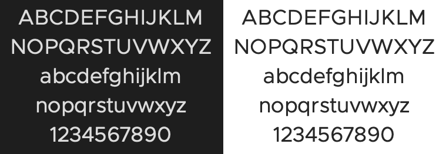

# Clarity City

Clarity City is an open source sans-serif typeface. It is the default font for the VMware Clarity Design System.

We have provided the files in OpenType, TrueType, and WebFont (EOT, WOFF, WOFF2) file formats.

## Support & Contributions

Please use GitHub issues for reporting problems, and before submitting contributions please open an issue to discuss your proposed changes. We will consider contributions, though we aim to keep a very stable font and limit releases to essential changes and fixes.

## Code of Conduct

Please be respectful of others and follow our [code of conduct](./CODE-OF-CONDUCT.md).

## License

Licensed under Open Font License (OFL). See [LICENSE](./LICENSE).

### Attribution

Clarity City is based upon the work done by @chrismsimpson on [Metropolis](https://github.com/chrismsimpson/Metropolis).